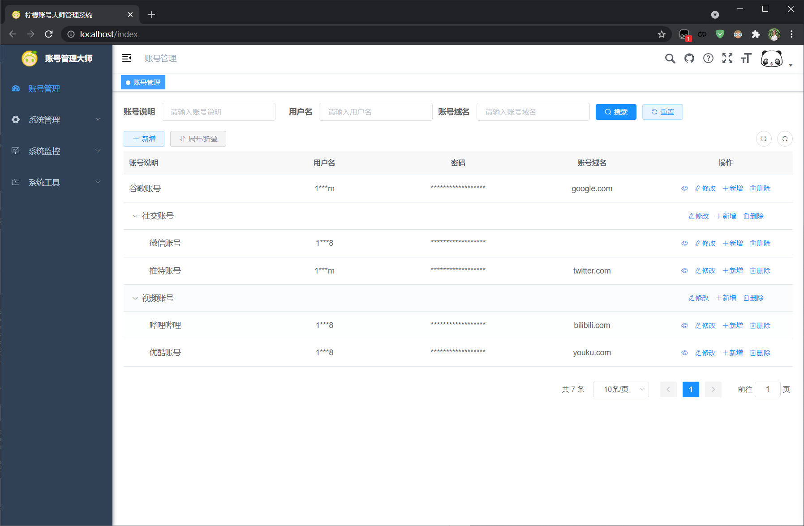
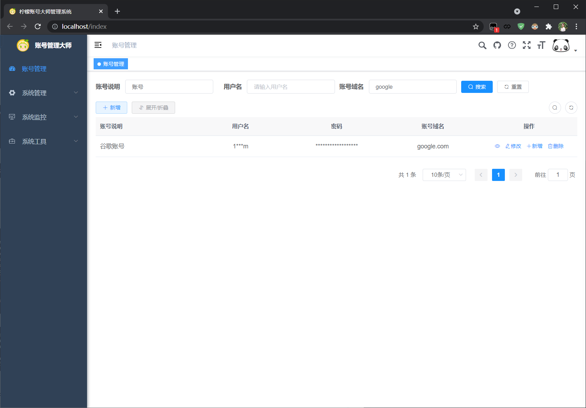
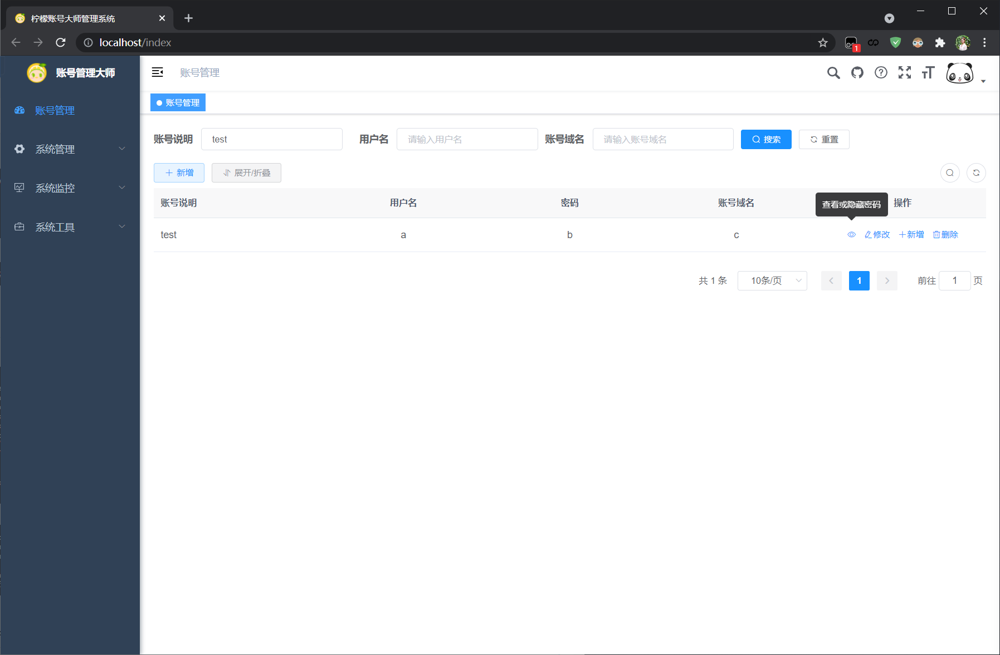
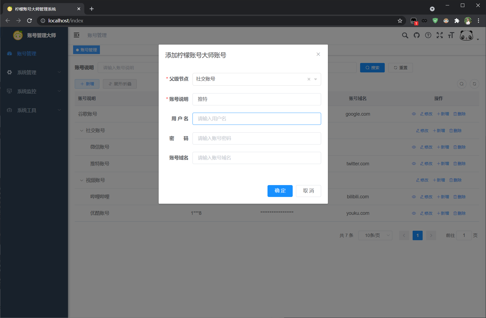
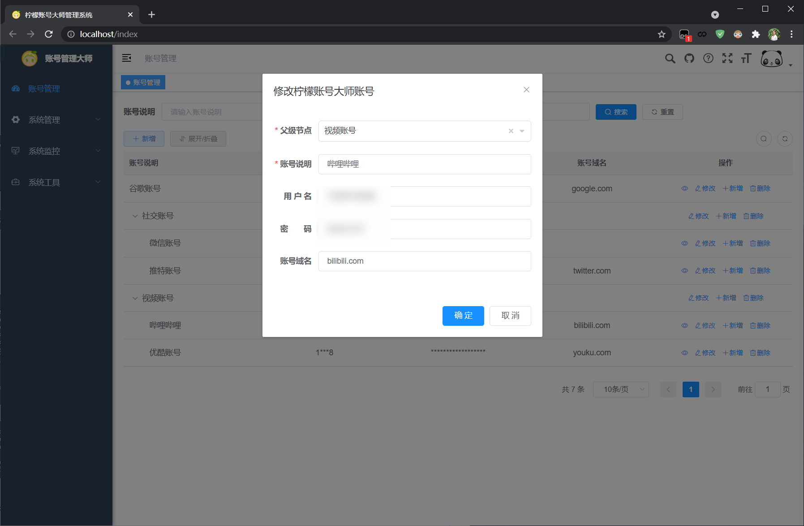
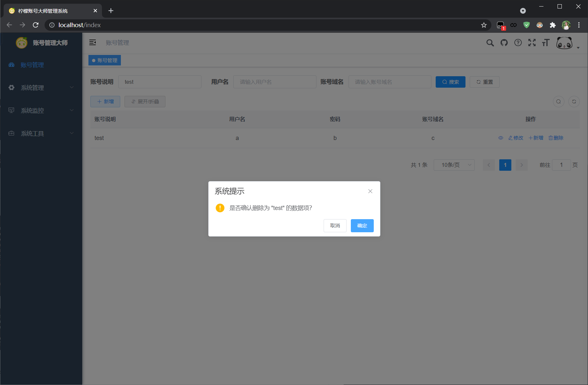
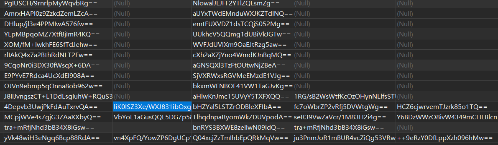
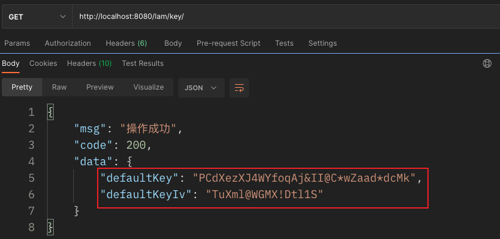
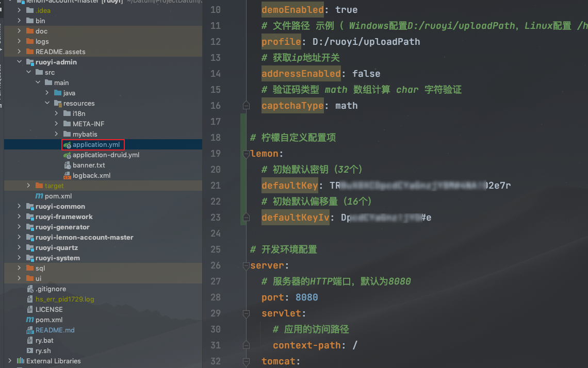

**柠檬账号管理大师**

# 介绍

基于RuoYi3.8.5 + MyBatis-Plus3.5.1开发的账户管理系统，一站式管理个人名下的所有的账户密码，数据做到层层加密，哪怕数据库被撞开，也无法破译里面的信息，安全性极高。

# 快速了解

## 个人账号管理

**账号总览**



**条件搜索**



**密码查看**



**账号新增**



**账号修改**



**账号移除**



## 数据极限加密

数据表中全加密字段，且每条数据加密都是不一样的，极限加密



## 项目默认密钥

项目默认密钥在配置文件中自定义的

这里的默认密钥是项目的默认密钥，并不是数据加密的密钥，数据是动态密钥，多重加密。

项目运行后可以通过请求获取随机的一组密钥：

```http
GET
http://localhost:8080/lam/key/
```





# 项目部署

* 基础部署可以参考：[环境部署 | RuoYi](http://doc.ruoyi.vip/ruoyi-vue/document/hjbs.html#%E9%83%A8%E7%BD%B2%E7%B3%BB%E7%BB%9F)

## Docker部署

所需环境全用Docker部署（`MySQL8` + `Redis` + `Nginx`）

Docker不同的容器间会存在网络不能互通的问题，因此，需要将所需环境+项目全部都部署到同一个网络下

### 创建网桥

在Docker中创建共用网桥

```shell
# 创建本地桥接网络
docker network create localnet
# 查看本地网络
docker network ls
```


### Nginx

```shell
docker run -d -p 9090:80  \
--name nginx \
--network localnet \
--network-alias nginx \
-v /mnt/docker-volume/nginx/html:/usr/share/nginx/html \
-v /mnt/docker-volume/nginx/conf/nginx.conf:/etc/nginx/nginx.conf \
-v /mnt/docker-volume/nginx/conf/conf.d:/etc/nginx/conf.d \
-v /mnt/docker-volume/nginx/logs:/var/log/nginx \
nginx:latest
```

注意上述端口和外部挂载的目录可以改成自己的

### MySQL8

```shell
docker run \
--name mysql8 \
--network localnet \
--network-alias mysql8 \
-p 3306:3306 \
-v D:/Daturm/DockerVolume/mysql/conf:/etc/mysql/conf.d \
-v D:/Daturm/DockerVolume/mysql/data:/var/lib/mysql \
-v D:/Daturm/DockerVolume/mysql/log:/var/log/mysql \
-e MYSQL_ROOT_PASSWORD=root \
-e TZ=Asia/Shanghai \
-e default-time_zone='+8:00' \
-d mysql:8.0
```

### Redis

```shell
docker run \
--name redis \
--network localnet \
--network-alias redis \
-p 6379:6379 \
-v /opt/docker-volume/redis/data:/data \
-d redis redis-server \
--save 60 1 --loglevel warning
```