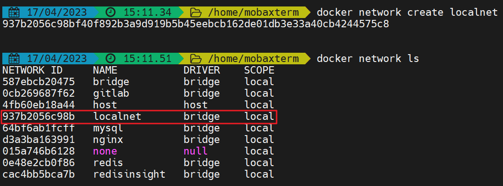
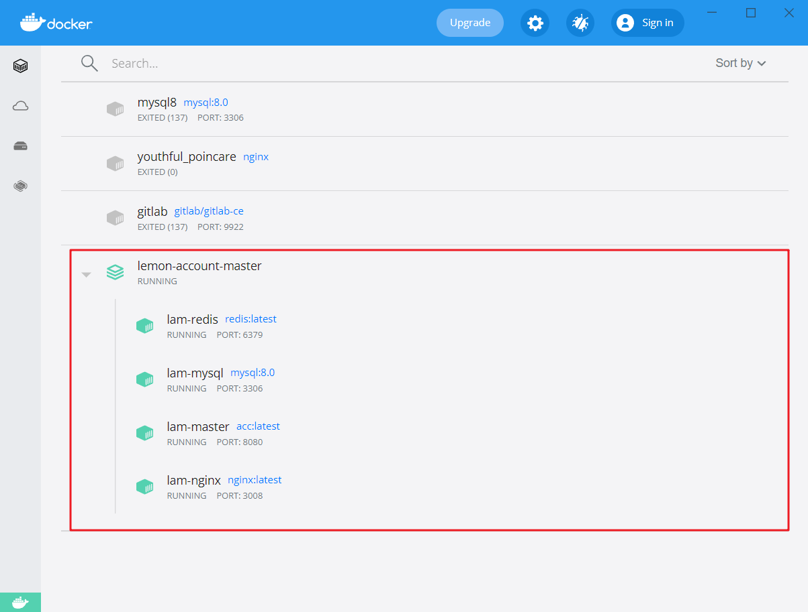

**柠檬账号管理大师**

# 介绍

基于RuoYi3.8.5 + MyBatis-Plus3.5.1开发的账户管理系统，一站式管理个人名下的所有的账户密码，数据做到层层加密，哪怕数据库被撞开，也无法破译里面的信息，安全性极高。

# 快速了解

## 个人账号管理

**账号总览**


**条件搜索**


**密码查看**


**账号新增**


**账号修改**


**账号移除**


## 数据极限加密

数据表中全加密字段，且每条数据加密都是不一样的，极限加密


## 项目默认密钥

项目默认密钥在配置文件中自定义的

这里的默认密钥是项目的默认密钥，并不是数据加密的密钥，数据是动态密钥，多重加密。

项目运行后可以通过请求获取随机的一组密钥：

```http
GET
http://localhost:8080/lam/key/
```


# 项目部署

* 基础部署可以参考：[环境部署 | RuoYi](http://doc.ruoyi.vip/ruoyi-vue/document/hjbs.html#%E9%83%A8%E7%BD%B2%E7%B3%BB%E7%BB%9F)

## Docker-Compose

所需环境全用Docker部署（`MySQL8` + `Redis` + `Nginx`）

Docker不同的容器间会存在网络不能互通的问题，因此，需要将所需环境+项目全部都部署到同一个网络下

这里用到的所有环境都是docker启动的，那么就涉及到一个docker容器的启动顺序，以及网络配置等，比如说项目要在redis和mysql启动完毕后才能启动，这里用docker-compose来实现一键启动。

### 项目配置及打包

#### 前端项目

前端项目打包很简单，参考若依官方文档即可

```shell
npm run build:prod
```

会在前端文件夹中生成一个`dist`的文件夹，这就是前端文件，等nginx环境配置好了以后就可以把该文件夹拷贝到nginx容器的映射目录中。


#### 后端项目

##### 配置

* **MySQL和Redis**
  
  这里利用docker-compose进行编排容器，所以配置上如下图做出改变
  
  
  
  

* 更改默认密钥（可选）
  
  注意，更改默认密钥后，初始的两个用户的默认密钥也要做出相应修改，这里简易用超管账户登录后重新创建一个用户，再将这个账户设为超管账户。
  
  

##### 打包

项目打包后，会生成一个`ruoyi-admin.jar`的文件


##### 创建docker镜像

将上面打包好的`ruoyi-admin.jar`和项目中的`Dockerfile`放在同一目录下

```shell
docker build -t lam-master .
```


### 环境部署

#### 创建网络

在Docker中创建共用网桥

```shell
# 创建本地桥接网络
docker network create localnet
# 查看本地网络
docker network ls
```



#### Docker-Compose

这里假设基础环境（Nginx+MySQL+Redis）的外部挂载配置都已经设置好了，若没有设置好的，可以先参看：[NicolasLemon/awesome-notes · GitHub](https://github.com/NicolasLemon/awesome-notes/blob/master/Docker/Docker-Notes.md)

接下来就可以利用项目中的`docker-compose.yml`文件来一键启动了

（docker-compose.yml文件中需要将外部挂载的目录改成自己的外部的链接哦）

```shell
docker-compose up -d
```




此时单独访问后端，如图所示表示后端部分已经成功启动了


**docker-compose.yml**

```yaml
version: '3'

services:
  lam:
    image: lam-master:latest
    container_name: lam-master
    # 网络
    networks:
      - localnet
    # 端口映射
    ports:
      - 8080:8080
    # 外部挂载
    volumes:
      # 日志
      - D:/Daturm/LemonAccountMaster/logs:/logs
    # 健康检查
    healthcheck:
      # http://localhost:8080/heart/ 为容器指定的健康检查接口
      test: ["CMD", "curl", "-f", "http://localhost:8080/heart/"]
      # 健康检查的间隔，默认为 30 秒，单位(h/m/s)；
      interval: 30s 
      # 健康检查命令运行超时时间，如果超过这个时间，本次健康检查就被视为失败，单位(h/m/s)；
      timeout: 20s
      # 当连续失败指定次数后，则将容器状态视为 unhealthy。
      retries: 5
    # 启动依赖于
    depends_on:
      - mysql
      - redis

  mysql:
    image: mysql:8.0
    container_name: lam-mysql
    networks:
      - localnet
    # 环境配置
    environment:
      # 默认ROOT密码
      MYSQL_ROOT_PASSWORD: root
      # 设置时区
      TZ: Asia/Shanghai
      default-time_zone: +8:00
    # 端口映射
    ports:
      - 3306:3306
    # 外部挂载
    volumes:
      # 配置
      - D:/Daturm/DockerVolume/mysql/conf:/etc/mysql/conf.d
      # 数据
      - D:/Daturm/DockerVolume/mysql/data:/var/lib/mysql
      # 日志
      - D:/Daturm/DockerVolume/mysql/log:/var/log/mysql
    # 解决外部无法访问
    command: --default-authentication-plugin=mysql_native_password

  redis:
    # 镜像名称
    image: redis:latest
    # 容器名称
    container_name: lam-redis
    # 网络
    networks:
      - localnet
    # 端口映射
    ports:
      - 6379:6379
    # 外部挂载
    volumes:
      # 配置
      - D:/Daturm/DockerVolume/redis/redis.conf:/etc/redis.conf:ro
      # 数据
      - D:/Daturm/DockerVolume/redis/data:/data
    # 加载配置项
    command: redis-server /etc/redis.conf

  nginx:
    # 镜像名称
    image: nginx:latest
    # 容器名称
    container_name: lam-nginx
    # 网络
    networks:
      - localnet
    # 端口映射
    ports:
      # 这里是映射原本的80端口
      - 9090:80
      # 映射自定义端口
      - 3008:3008
    # 外部挂载
    volumes:
      # 首页
      - D:/Daturm/DockerVolume/nginx/html:/usr/share/nginx/html
      # 配置
      - D:/Daturm/DockerVolume/nginx/conf/nginx.conf:/etc/nginx/nginx.conf
      - D:/Daturm/DockerVolume/nginx/conf/conf.d:/etc/nginx/conf.d
      # 日志
      - D:/Daturm/DockerVolume/nginx/logs:/var/log/nginx
    depends_on:
      lam:
        condition: service_healthy

# 网络配置
networks:
  # 链接到本地的localnet中
  localnet:
    external: true
```

### 静态资源配置

在上述步骤中，已经将后端配置好了，现在就配置前端的静态资源和nginx就行了

1. 将前面打包好的前端`dist`文件夹放入nginx外部挂载文件夹中
   
   

2. 修改nginx配置
   
   
   
   **lam.conf**
   
   ```config
   server {
       listen       3008;
       listen  [::]:3008;
       server_name  localhost;
   
       location / {
           root   /usr/share/nginx/html/dist;
   		try_files $uri $uri/ /index.html;
           index  index.html index.htm;
       }
   
       location /prod-api/ {
   		proxy_set_header Host $http_host;
   		proxy_set_header X-Real-IP $remote_addr;
   		proxy_set_header REMOTE-HOST $remote_addr;
   		proxy_set_header X-Forwarded-For $proxy_add_x_forwarded_for;
   		proxy_pass http://lam:8080/;
   	}
   
       location /profile/upload/ {
           proxy_pass http://lam:8080/profile/upload/;
       }
   
       error_page   500 502 503 504  /50x.html;
       location = /50x.html {
           root   html;
       }
   
   }
   
   ```

3. 重启nginx容器，使配置重新生效
   
   ```shell
   docker restart lam-nginx
   ```

接下来就可以访问了

```http
http://localhost:3008/
```


